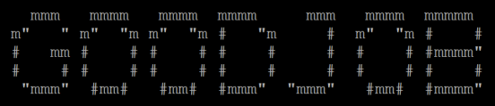

# PythonBanner

Avanzado: programa en Python una aplicación que reciba como entrada una
cadena de caracteres e imprime por consola el texto en formato banner ampliado.

Ejemplo de entrada: GOODJOB

Ejemplo de salida: 

Para simplificar el desarrollo, ten presente las siguientes características:
▪ No distinguir entre mayúsculas y minúsculas, todo en mayúsculas.
▪ No tengas presente los caracteres especiales como la ñ ç entre otros....
▪ El formato del banner es libre, pero se aconseja ser lo más práctico.